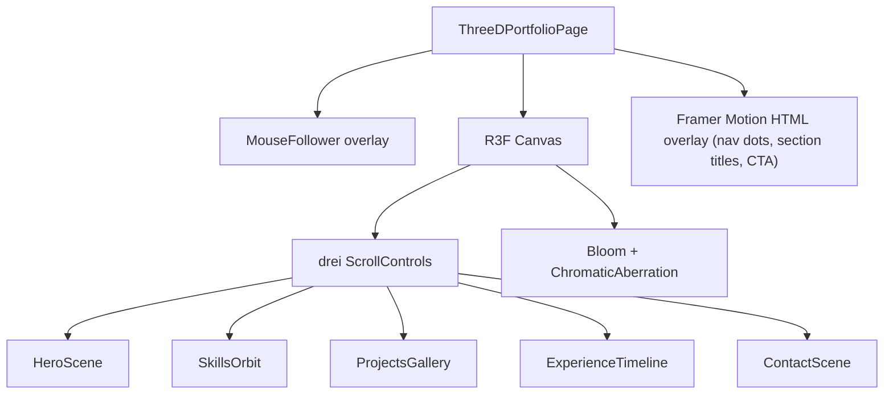

## Stack additions

Install:
- `react-router-dom` — routing for `/` (existing) and `/3d`.
- `three`, `@react-three/fiber`, `@react-three/drei` — declarative 3D scenes, post-processing, helpers (Stars, Float, Text3D, Environment, ContactShadows, Html, useScroll).
- `@react-three/postprocessing` (optional) — bloom + chromatic aberration for cinematic look.
- Reuse existing `framer-motion` for overlay UI transitions, mouse-tilt cards, and page transitions via `AnimatePresence`.

## Routing

Refactor [src/main.tsx](src/main.tsx) to wrap `<App />` in `BrowserRouter`, then convert [src/App.tsx](src/App.tsx) to use `<Routes>`:

- `/` → existing single-page layout (`Header` + sections + `Footer`) extracted into `HomePage.tsx`.
- `/3d` → new `ThreeDPortfolioPage.tsx` (no shared `Header`/`Footer`; has its own immersive shell).
- Add a "View 3D Portfolio" CTA button in `Header.tsx` linking to `/3d`, and a "Back to classic" link inside the 3D page.

## New files

- `src/pages/HomePage.tsx` — extracted current home content (no logic change).
- `src/pages/ThreeDPortfolioPage.tsx` — top-level page; sets up `<Canvas>`, scroll controller, overlay UI, page-enter Framer Motion transition, and a custom 3D mouse cursor.
- `src/three/scenes/HeroScene.tsx` — animated hero: floating distorted sphere (`MeshDistortMaterial` from drei), orbiting particles, `Stars` background, `Text3D` of name, light rig, mouse-parallax camera.
- `src/three/scenes/SkillsOrbit.tsx` — skills rendered as glowing nodes orbiting a central core; hover scales + tooltip via `Html`. Data sourced from `portfolioData.ts` `SkillsData`.
- `src/three/scenes/ProjectsGallery.tsx` — curved carousel of project "cards" as 3D planes with image textures; drag/scroll to rotate; click to open Framer Motion modal.
- `src/three/scenes/ExperienceTimeline.tsx` — vertical 3D timeline (extruded path + floating company logo billboards) tied to scroll progress via drei `ScrollControls` / `useScroll`.
- `src/three/scenes/ContactScene.tsx` — closing scene with floating contact card (Framer Motion `motion.div` overlay) and animated email/social icons.
- `src/three/components/MouseFollower.tsx` — custom animated cursor (Framer Motion spring) with magnetic hover on interactive elements.
- `src/three/components/SceneTransition.tsx` — `AnimatePresence` wrapper for section overlays as user scrolls.
- `src/three/components/Loader.tsx` — drei `Html` + Framer Motion progress ring for `Suspense` fallback.

## ThreeDPortfolioPage architecture



Key behaviors:
- `useScroll()` from drei drives section opacity, camera dolly, and Framer Motion overlay text via `useTransform`.
- Mouse position (normalized in a top-level `useEffect` listener) feeds a context that camera and `MouseFollower` consume for parallax and magnetic hover.
- Page mount: Framer Motion fade + scale-in on overlay; Canvas fades from black via a fullscreen `motion.div`.
- Reduced-motion: respect `prefers-reduced-motion` to skip auto rotations.

## Marketing content

Pull from existing [src/data/portfolioData.ts](src/data/portfolioData.ts) (`WorkData`, `SkillsData`, `ProjectsData`, `personal`). Add a `marketing` block (headline, tagline, three "value pillars", CTA copy) to the same file so the 3D hero has punchy copy without duplicating data:

```ts
export const MarketingData = {
  headline: "Full-Stack Engineer crafting cinematic web experiences",
  tagline: "5+ years shipping AI-powered, performance-obsessed products",
  pillars: ["AI + GenAI integrations", "Cloud-native CI/CD", "Pixel-perfect UX at 60fps"],
  primaryCta: { label: "Hire me", href: "#contact" },
  secondaryCta: { label: "View classic site", href: "/" },
};
```

## Styling

- Reuse Tailwind for overlay UI (glassmorphism cards: `backdrop-blur-xl bg-white/5 border border-white/10`).
- Dark space-gradient background behind canvas; theme-aware via existing `useTheme`.
- Smooth font: load `Inter` via existing setup; use drei `Text` with MSDF font for crisp 3D text.

## Risks / notes

- R3F + Vite works out of the box; no config changes expected.
- Keep `<Canvas dpr={[1, 1.5]} gl={{ antialias: true }}>` and lazy-load `ThreeDPortfolioPage` via `React.lazy` so the existing home bundle stays small.
- Postprocessing is optional — guard behind a perf check (`navigator.hardwareConcurrency`) to avoid jank on low-end devices.